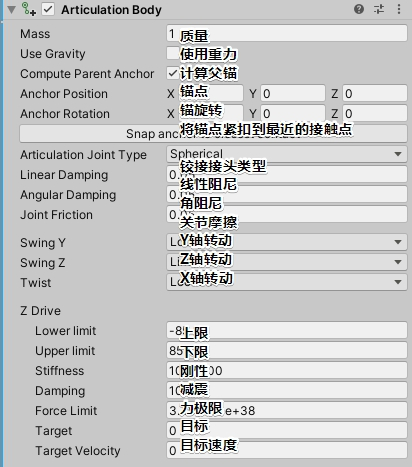

# ***\*ArticulationBody\****

## ***\*描述\****

A body that forms part of a Physics articulation.

构成物理连接的一部分的物体。

An articulation is a set of bodies arranged in a logical tree. The parent-child link in this tree reflects that the bodies have their relative motion constrained. 

联接是在逻辑树中排列的一组主体。这棵树的父-子链反映了物体的相对运动受到了约束。

Articulations are solved by a Featherstone solver that works in reduced coordinates - that is each body has relative coordinates to its parent but only along the unlocked degrees of freedom. 

铰接由Featherstone解算器解决，该解算器在简化的坐标中工作-即每个物体相对于其父对象具有相对坐标，但仅沿解锁的自由度。

This guarantees there is no unwanted stretch.

这保证了没有不必要的拉伸。
Like with regular Joints, there are two anchors for each pair of connected articulation bodies. 

像常规关节一样，每对连接的关节体都有两个锚。

One anchor is defined in the parent body's reference frame, whereas the other one is defined in the child's reference frame.

在母体的参考系中定义了一个锚点，而在孩子的参考系中定义了另一个锚点。

 Changing the constraints, you directly affect the allowed space for relative positions of the two anchors. 

更改约束后，将直接影响两个锚的相对位置的允许空间。

For instance, [ArticulationDofLock.LockedMotion](https://docs.unity3d.com/cn/2020.2/ScriptReference/ArticulationDofLock.LockedMotion.html) will not allow any relative motion at all.

例如，ArticulationDofLock.LockedMotion将根本不允许任何相对运动。

## ***\*变量\****

| [anchorPosition](https://docs.unity3d.com/cn/2020.2/ScriptReference/ArticulationBody-anchorPosition.html) | Position of the anchor relative to this body.锚相对于这个物体的位置。 |
| ------------------------------------------------------------ | ------------------------------------------------------------ |
| [anchorRotation](https://docs.unity3d.com/cn/2020.2/ScriptReference/ArticulationBody-anchorRotation.html) | Rotation of the anchor relative to this body.锚相对于这个物体的旋转。 |
| [angularDamping](https://docs.unity3d.com/cn/2020.2/ScriptReference/ArticulationBody-angularDamping.html) | Damping factor that affects how this body resists rotations.影响物体抵抗旋转的阻尼因子。 |
| [angularVelocity](https://docs.unity3d.com/cn/2020.2/ScriptReference/ArticulationBody-angularVelocity.html) | The angular velocity of the body defined in world space.在世界空间中定义的物体的角速度。 |
| [centerOfMass](https://docs.unity3d.com/cn/2020.2/ScriptReference/ArticulationBody-centerOfMass.html) | The center of mass of the body defined in local space.在局部空间中定义的物体的质心。 |
| [dofCount](https://docs.unity3d.com/cn/2020.2/ScriptReference/ArticulationBody-dofCount.html) | The amount of degrees of freedom of a body.一个物体的自由度。 |
| [immovable](https://docs.unity3d.com/cn/2020.2/ScriptReference/ArticulationBody-immovable.html) | Allows you to specify that this body is not movable.允许您指定此主体不可移动 |
| [index](https://docs.unity3d.com/cn/2020.2/ScriptReference/ArticulationBody-index.html) | The index of the body in the hierarchy of articulation bodies.在关节体的等级中身体的索引。 |
| [inertiaTensor](https://docs.unity3d.com/cn/2020.2/ScriptReference/ArticulationBody-inertiaTensor.html) | The inertia tensor of this body.这个物体的惯性张量。         |
| [inertiaTensorRotation](https://docs.unity3d.com/cn/2020.2/ScriptReference/ArticulationBody-inertiaTensorRotation.html) | 惯性张量的旋转。                                             |
| [isRoot](https://docs.unity3d.com/cn/2020.2/ScriptReference/ArticulationBody-isRoot.html) | Indicates whether this body is the root body of the articulation (Read Only).指示此主体是否为清晰度的根主体(只读)。 |
| [jointAcceleration](https://docs.unity3d.com/cn/2020.2/ScriptReference/ArticulationBody-jointAcceleration.html) | The joint acceleration in reduced coordinates.约化坐标下的关节加速度。 |
| [jointForce](https://docs.unity3d.com/cn/2020.2/ScriptReference/ArticulationBody-jointForce.html) | The joint force in reduced coordinates.在简化坐标下的联合力。 |
| [jointFriction](https://docs.unity3d.com/cn/2020.2/ScriptReference/ArticulationBody-jointFriction.html) | Allows you to specify the amount of friction that is applied as a result of connected bodies moving relative to this body.允许您指定摩擦量，该应用的结果，连接的物体相对于该物体运动。 |
| [jointPosition](https://docs.unity3d.com/cn/2020.2/ScriptReference/ArticulationBody-jointPosition.html) | The joint position in reduced coordinates.在简化坐标下的关节位置。 |
| [jointType](https://docs.unity3d.com/cn/2020.2/ScriptReference/ArticulationBody-jointType.html) | The type of joint connecting this body to its parent body.连接此阀体和其父阀体的接头类型。 |
| [jointVelocity](https://docs.unity3d.com/cn/2020.2/ScriptReference/ArticulationBody-jointVelocity.html) | The joint velocity in reduced coordinates.在简化坐标下的关节速度。 |
| [linearDamping](https://docs.unity3d.com/cn/2020.2/ScriptReference/ArticulationBody-linearDamping.html) | Damping factor that affects how this body resists linear motion.影响物体抵抗线性运动的阻尼因子 |
| [linearLockX](https://docs.unity3d.com/cn/2020.2/ScriptReference/ArticulationBody-linearLockX.html) | The type of lock along X axis of movement.该类型锁沿X轴运动  |
| [linearLockY](https://docs.unity3d.com/cn/2020.2/ScriptReference/ArticulationBody-linearLockY.html) | The type of lock along Y axis of movement.该类型锁沿Y轴运动  |
| [linearLockZ](https://docs.unity3d.com/cn/2020.2/ScriptReference/ArticulationBody-linearLockZ.html) | The type of lock along Z axis of movement.该类型锁沿Z轴运动  |
| [mass](https://docs.unity3d.com/cn/2020.2/ScriptReference/ArticulationBody-mass.html) | The mass of this articulation body.这个关节体的质量          |
| [maxAngularVelocity](https://docs.unity3d.com/cn/2020.2/ScriptReference/ArticulationBody-maxAngularVelocity.html) | The maximimum angular velocity of the articulation body measured in radians per second.关节体的最大角速度，以每秒弧度计。 |
| [maxDepenetrationVelocity](https://docs.unity3d.com/cn/2020.2/ScriptReference/ArticulationBody-maxDepenetrationVelocity.html) | The maximum velocity of an articulation body when moving out of penetrating state.当关节体移动出穿透状态时的最大速度。 |
| [maxJointVelocity](https://docs.unity3d.com/cn/2020.2/ScriptReference/ArticulationBody-maxJointVelocity.html) | The maximum joint velocity of the articulation body joint in reduced coordinates.在简化坐标下的最大关节速度 |
| [maxLinearVelocity](https://docs.unity3d.com/cn/2020.2/ScriptReference/ArticulationBody-maxLinearVelocity.html) | The maximum linear velocity of the articulation body measured in meters per second.关节体的最大线速度，以米每秒为单位。 |
| [parentAnchorPosition](https://docs.unity3d.com/cn/2020.2/ScriptReference/ArticulationBody-parentAnchorPosition.html) | Position of the anchor relative to this body's parent.锚点相对于此实体父级的位置。 |
| [parentAnchorRotation](https://docs.unity3d.com/cn/2020.2/ScriptReference/ArticulationBody-parentAnchorRotation.html) | Position of the anchor relative to this body's parent.       |
| [sleepThreshold](https://docs.unity3d.com/cn/2020.2/ScriptReference/ArticulationBody-sleepThreshold.html) | 经过质量标准化的能量阈值 - 当低于该阈值时，对象开始进入睡眠状态。 |
| [solverIterations](https://docs.unity3d.com/cn/2020.2/ScriptReference/ArticulationBody-solverIterations.html) | The solverIterations determines how accurately articulation body joints and collision contacts are resolved.solverIterations决定如何精确的关节身体关节和碰撞接触被解决。 |
| [solverVelocityIterations](https://docs.unity3d.com/cn/2020.2/ScriptReference/ArticulationBody-solverVelocityIterations.html) | The solverVelocityIterations affects how accurately articulation body joints and collision contacts are resolved during bounce.solverVelocityIterations影响如何准确的关节身体关节和碰撞接触被解决在弹跳。 |
| [swingYLock](https://docs.unity3d.com/cn/2020.2/ScriptReference/ArticulationBody-swingYLock.html) | The magnitude of the conical swing angle relative to Y axis.相对于Y轴的圆锥摆动角的大小。 |
| [swingZLock](https://docs.unity3d.com/cn/2020.2/ScriptReference/ArticulationBody-swingZLock.html) | The magnitude of the conical swing angle relative to Z axis.相对于Z轴的圆锥摆动角的大小。 |
| [twistLock](https://docs.unity3d.com/cn/2020.2/ScriptReference/ArticulationBody-twistLock.html) | The type of lock for twist movement.用于扭转运动的锁类型(相对于X轴) |
| [useGravity](https://docs.unity3d.com/cn/2020.2/ScriptReference/ArticulationBody-useGravity.html) | Controls whether gravity affects this articulation body.控制重力是否影响关节体。 |
| [velocity](https://docs.unity3d.com/cn/2020.2/ScriptReference/ArticulationBody-velocity.html) | Linear velocity of the body defined in world space.物体的线速度定义在世界空间。 |
| [worldCenterOfMass](https://docs.unity3d.com/cn/2020.2/ScriptReference/ArticulationBody-worldCenterOfMass.html) | The center of mass of the body defined in world space (Read Only).物体的质心定义在世界空间(只读)。 |
| [xDrive](https://docs.unity3d.com/cn/2020.2/ScriptReference/ArticulationBody-xDrive.html) | The properties of drive along or around X.沿着X轴或X轴附近行驶的特性。 |
| [yDrive](https://docs.unity3d.com/cn/2020.2/ScriptReference/ArticulationBody-yDrive.html) | The properties of drive along or around Y.沿着Y轴或Y轴附近行驶的特性。 |
| [zDrive](https://docs.unity3d.com/cn/2020.2/ScriptReference/ArticulationBody-zDrive.html) | The properties of drive along or around Z.沿着Z轴或Z轴附近行驶的特性。 |

## ***\*公共函数\****

| [AddForce](https://docs.unity3d.com/cn/2020.2/ScriptReference/ArticulationBody.AddForce.html) | Add force to the articulation body.给关节体加力。            |
| ------------------------------------------------------------ | ------------------------------------------------------------ |
| [AddForceAtPosition](https://docs.unity3d.com/cn/2020.2/ScriptReference/ArticulationBody.AddForceAtPosition.html) | Applies a force at a specific position, resulting in applying a torque and force on the object.在一个特定的位置施加一个力，导致在物体上施加一个力矩和力。 |
| [AddRelativeForce](https://docs.unity3d.com/cn/2020.2/ScriptReference/ArticulationBody.AddRelativeForce.html) | Applies a force to the articulation body, relative to its local coordinate system.对关节体施加一个相对于其局部坐标系的力 |
| [AddRelativeTorque](https://docs.unity3d.com/cn/2020.2/ScriptReference/ArticulationBody.AddRelativeTorque.html) | Applies a torque to the articulation body, relative to its local coordinate system.对关节体施加一个力矩，相对于它的局部坐标系。 |
| [AddTorque](https://docs.unity3d.com/cn/2020.2/ScriptReference/ArticulationBody.AddTorque.html) | Add torque to the articulation body.给关节体增加扭矩。       |
| [GetClosestPoint](https://docs.unity3d.com/cn/2020.2/ScriptReference/ArticulationBody.GetClosestPoint.html) | Return the point on the articulation body that is closest to a given one.***\*返回关节体上最接近给定点的点。\****This returns the input point in case it was not possible to calculate the actual closest point for some reason.这将返回输入点，以防由于某种原因无法计算出实际的最近点。 |
| [GetDenseJacobian](https://docs.unity3d.com/cn/2020.2/ScriptReference/ArticulationBody.GetDenseJacobian.html) | Calculates and writes dense Jacobian matrix of the articulation body hierarchy to the supplied struct.***\*计算并将联接体层次结构的密集雅可比矩阵写入所提供的结构。\****This calculates dense Jacobian matrix of the entire articulation body hierarchy starting from root articulation body. Number of rows [ArticulationJacobian.rows](https://docs.unity3d.com/cn/2020.2/ScriptReference/ArticulationJacobian-rows.html) of the matrix is equal to the number of articulation bodies in hierarchy times 6: 3 rows of linear/positional DOF and 3 rows of angular/rotational DOF for each body. Number of columns [ArticulationJacobian.columns](https://docs.unity3d.com/cn/2020.2/ScriptReference/ArticulationJacobian-columns.html) of the matrix is equal to the total number of all joints degrees of freedom(DOF), plus 6 if [ArticulationBody.immovable](https://docs.unity3d.com/cn/2020.2/ScriptReference/ArticulationBody-immovable.html) is false. See Also: [index](https://docs.unity3d.com/cn/2020.2/ScriptReference/ArticulationBody-index.html), [ArticulationJacobian](https://docs.unity3d.com/cn/2020.2/ScriptReference/ArticulationJacobian.html), [GetDofStartIndices](https://docs.unity3d.com/cn/2020.2/ScriptReference/ArticulationBody.GetDofStartIndices.html).从根关节体开始，计算整个关节体层次的密集雅可比矩阵。 矩阵的关节数Jacobian。行数等于层次结构乘以6时关节体的数量：每个物体3行线性/位置自由度和3行角度/旋转自由度。 矩阵的ArticulationJacobian.columns列数等于所有关节自由度（DOF）的总数，如果ArticulationBody.immovable为false，则加6。 另请参见：index，ArticulationJacobian，GetDofStartIndices |
| [GetDofStartIndices](https://docs.unity3d.com/cn/2020.2/ScriptReference/ArticulationBody.GetDofStartIndices.html) | Calculates and reads back reduced coordinate data start indexes in reduced coordinate data buffer for every articulation body in the hierarchy.***\*计算并回读层次结构中每个联接体的简化坐标数据缓冲区中的简化坐标数据起始索引。\****In order to read back or set entire articulation hierarchy data in reduced coordinates where every degree of freedom is represented by float value, one needs to find the location of reduced cordinates data for particular ArticulationBody. This can be achieved by calling [ArticulationBody.GetDofStartIndices](https://docs.unity3d.com/cn/2020.2/ScriptReference/ArticulationBody.GetDofStartIndices.html) and indexing resulting list by the particular body index via [ArticulationBody.index](https://docs.unity3d.com/cn/2020.2/ScriptReference/ArticulationBody-index.html). Number of degrees of freedom for particular articulation body can be found using [ArticulationBody.dofCount](https://docs.unity3d.com/cn/2020.2/ScriptReference/ArticulationBody-dofCount.html). See Also: [index](https://docs.unity3d.com/cn/2020.2/ScriptReference/ArticulationBody-index.html), [GetDofStartIndices](https://docs.unity3d.com/cn/2020.2/ScriptReference/ArticulationBody.GetDofStartIndices.html), [dofCount](https://docs.unity3d.com/cn/2020.2/ScriptReference/ArticulationBody-dofCount.html).为了在简化的坐标中读回或设置整个关节运动层次结构数据，其中每个自由度都由浮点值表示，需要为特定的ArticulationBody查找简化的坐标数据的位置。 这可以通过调用ArticulationBody.GetDofStartIndices并通过ArticulationBody.index通过特定的身体索引对结果列表进行索引来实现。 可以使用ArticulationBody.dofCount找到特定关节体的自由度数 |
| [GetDriveTargets](https://docs.unity3d.com/cn/2020.2/ScriptReference/ArticulationBody.GetDriveTargets.html) | Reads back articulation body joint drive targets of the entire hierarchy to the supplied list of floats.***\*将整个层次结构的关节运动关节关节驱动目标读回提供的浮子列表。\****This returns joint drive targets in the reduced coordinate space for the entire articulation hierarchy starting from root to the supplied list of floats. Every joint drive target DOF is represented by one float value, however depending on the type of the articulation joint there might be zero, one or 3 DOFs per joint. The exact location of the data in resulting list for the specific articulation body can be found by calling [ArticulationBody.GetDofStartIndices](https://docs.unity3d.com/cn/2020.2/ScriptReference/ArticulationBody.GetDofStartIndices.html) and indexing returned dofStartIndices list by the particular body index via [ArticulationBody.index](https://docs.unity3d.com/cn/2020.2/ScriptReference/ArticulationBody-index.html). Number of degrees of freedom for the articulation body can be found using [ArticulationBody.dofCount](https://docs.unity3d.com/cn/2020.2/ScriptReference/ArticulationBody-dofCount.html). See Also: [index](https://docs.unity3d.com/cn/2020.2/ScriptReference/ArticulationBody-index.html), [GetDofStartIndices](https://docs.unity3d.com/cn/2020.2/ScriptReference/ArticulationBody.GetDofStartIndices.html), [dofCount](https://docs.unity3d.com/cn/2020.2/ScriptReference/ArticulationBody-dofCount.html), [SetDriveTargets](https://docs.unity3d.com/cn/2020.2/ScriptReference/ArticulationBody.SetDriveTargets.html).从根到提供的浮标列表，这将在整个关节层次结构的缩小坐标空间中返回关节驱动目标。 每个关节驱动目标自由度都由一个浮点值表示，但是，根据关节的类型，每个关节可能有零，一个或三个自由度。 可以通过调用ArticulationBody.GetDofStartIndices并通过ArticulationBody.index通过特定的身体索引来索引返回的dofStartIndices列表，来找到特定关节主体的结果列表中数据的确切位置。 可以使用ArticulationBody.dofCount找到关节主体的自由度数。 另请参见：index，GetDofStartIndices，dofCount，SetDriveTargets。 |
| [GetDriveTargetVelocities](https://docs.unity3d.com/cn/2020.2/ScriptReference/ArticulationBody.GetDriveTargetVelocities.html) | Reads back articulation body joint drive target velocities of the entire hierarchy to the supplied list of floats .***\*将整个层次结构的关节驱动目标速度读入所提供的浮动列表。\****This returns joint drive target velocities in the reduced coordinate space for the entire articulation hierarchy starting from root to the supplied list of floats. Every joint target velocity DOF is represented by one float value, however depending on the type of the articulation joint there might be zero, one or 3 DOFs per joint. The exact location of the data in resulting list for the specific articulation body can be found by calling [ArticulationBody.GetDofStartIndices](https://docs.unity3d.com/cn/2020.2/ScriptReference/ArticulationBody.GetDofStartIndices.html) and indexing returned dofStartIndices list by the particular body index via [ArticulationBody.index](https://docs.unity3d.com/cn/2020.2/ScriptReference/ArticulationBody-index.html). Number of degrees of freedom for the articulation body can be found using [ArticulationBody.dofCount](https://docs.unity3d.com/cn/2020.2/ScriptReference/ArticulationBody-dofCount.html). See Also: [index](https://docs.unity3d.com/cn/2020.2/ScriptReference/ArticulationBody-index.html), [GetDofStartIndices](https://docs.unity3d.com/cn/2020.2/ScriptReference/ArticulationBody.GetDofStartIndices.html), [dofCount](https://docs.unity3d.com/cn/2020.2/ScriptReference/ArticulationBody-dofCount.html), [SetDriveTargets](https://docs.unity3d.com/cn/2020.2/ScriptReference/ArticulationBody.SetDriveTargets.html).对于从根到提供的浮标列表，整个关节层次结构，这将在减小的坐标空间中返回关节驱动目标速度。 每个关节目标速度DOF由一个浮点值表示，但是根据关节的类型，每个关节可能有零，一个或三个DOF。 可以通过调用ArticulationBody.GetDofStartIndices并通过ArticulationBody.index通过特定的身体索引来索引返回的dofStartIndices列表，来找到特定关节主体的结果列表中数据的确切位置。 可以使用ArticulationBody.dofCount找到关节主体的自由度数。 另请参见：index，GetDofStartIndices，dofCount，SetDriveTargets。 |
| [GetJointAccelerations](https://docs.unity3d.com/cn/2020.2/ScriptReference/ArticulationBody.GetJointAccelerations.html) | Reads back articulation body joint accelerations of the entire hierarchy to the supplied list of floats .***\*将整个层次结构的关节体关节加速读入所提供的浮动列表。\****This returns joint accelerations in the reduced coordinate space for the entire articulation hierarchy starting from root to the supplied list of floats. Every joint acceleration DOF is represented by one float value, however depending on the type of the articulation joint there might be zero, one or 3 DOFs per joint. The exact location of the data in resulting list for the specific articulation body can be found by calling [ArticulationBody.GetDofStartIndices](https://docs.unity3d.com/cn/2020.2/ScriptReference/ArticulationBody.GetDofStartIndices.html) and indexing returned dofStartIndices list by the particular body index via [ArticulationBody.index](https://docs.unity3d.com/cn/2020.2/ScriptReference/ArticulationBody-index.html). Number of degrees of freedom for the articulation body can be found using [ArticulationBody.dofCount](https://docs.unity3d.com/cn/2020.2/ScriptReference/ArticulationBody-dofCount.html). See Also: [index](https://docs.unity3d.com/cn/2020.2/ScriptReference/ArticulationBody-index.html), [GetDofStartIndices](https://docs.unity3d.com/cn/2020.2/ScriptReference/ArticulationBody.GetDofStartIndices.html), [dofCount](https://docs.unity3d.com/cn/2020.2/ScriptReference/ArticulationBody-dofCount.html), [SetJointAccelerations](https://docs.unity3d.com/cn/2020.2/ScriptReference/ArticulationBody.SetJointAccelerations.html).对于从根到提供的浮标列表的整个关节层次，这将在减小的坐标空间中返回关节加速度。 每个关节加速度自由度都由一个浮点值表示，但是根据关节的类型，每个关节可能有零，一个或三个自由度。 可以通过调用ArticulationBody.GetDofStartIndices并通过ArticulationBody.index通过特定的身体索引来索引返回的dofStartIndices列表，来找到特定关节主体的结果列表中数据的确切位置。 可以使用ArticulationBody.dofCount找到关节主体的自由度数。 另请参见：索引，GetDofStartIndices，dofCount，SetJointAccelerations。 |
| [GetJointForces](https://docs.unity3d.com/cn/2020.2/ScriptReference/ArticulationBody.GetJointForces.html) | Reads back articulation body joint forces of the entire hierarchy to the supplied list of floats .***\*将整个层次结构的关节体关节力读入所提供的浮动列表。\****This returns joint forces in the reduced coordinate space for the entire articulation hierarchy starting from root to the supplied list of floats. Every joint force DOF is represented by one float value, however depending on the type of the articulation joint there might be zero, one or 3 DOFs per joint. The exact location of the data in resulting list for the specific articulation body can be found by calling [ArticulationBody.GetDofStartIndices](https://docs.unity3d.com/cn/2020.2/ScriptReference/ArticulationBody.GetDofStartIndices.html) and indexing returned dofStartIndices list by the particular body index via [ArticulationBody.index](https://docs.unity3d.com/cn/2020.2/ScriptReference/ArticulationBody-index.html). Number of degrees of freedom for the articulation body can be found using [ArticulationBody.dofCount](https://docs.unity3d.com/cn/2020.2/ScriptReference/ArticulationBody-dofCount.html). See Also: [index](https://docs.unity3d.com/cn/2020.2/ScriptReference/ArticulationBody-index.html), [GetDofStartIndices](https://docs.unity3d.com/cn/2020.2/ScriptReference/ArticulationBody.GetDofStartIndices.html), [dofCount](https://docs.unity3d.com/cn/2020.2/ScriptReference/ArticulationBody-dofCount.html), [SetJointForces](https://docs.unity3d.com/cn/2020.2/ScriptReference/ArticulationBody.SetJointForces.html).对于从根到提供的浮标列表的整个关节层次，这将在减小的坐标空间中返回关节力。 每个关节力自由度用一个浮点值表示，但是根据关节的类型，每个关节可能有零个，一个或三个自由度。 可以通过调用ArticulationBody.GetDofStartIndices并通过ArticulationBody.index通过特定的身体索引来索引返回的dofStartIndices列表，来找到特定关节主体的结果列表中数据的确切位置。 可以使用ArticulationBody.dofCount找到关节主体的自由度数。 另请参见：索引，GetDofStartIndices，dofCount，SetJointForces。 |
| [GetJointPositions](https://docs.unity3d.com/cn/2020.2/ScriptReference/ArticulationBody.GetJointPositions.html) | Reads back articulation body joint positions of the entire hierarchy to the supplied list of floats .***\*将整个层次结构的连接体关节位置读入所提供的浮动列表。\****This returns joint positions in the reduced coordinate space for the entire articulation hierarchy starting from root to the supplied list of floats. Every joint position DOF is represented by one float value, however depending on the type of the articulation joint there might be zero, one or 3 DOFs per joint. The exact location of the data in resulting list for the specific articulation body can be found by calling [ArticulationBody.GetDofStartIndices](https://docs.unity3d.com/cn/2020.2/ScriptReference/ArticulationBody.GetDofStartIndices.html) and indexing returned dofStartIndices list by the particular body index via [ArticulationBody.index](https://docs.unity3d.com/cn/2020.2/ScriptReference/ArticulationBody-index.html). Number of degrees of freedom for the articulation body can be found using [ArticulationBody.dofCount](https://docs.unity3d.com/cn/2020.2/ScriptReference/ArticulationBody-dofCount.html). See Also: [index](https://docs.unity3d.com/cn/2020.2/ScriptReference/ArticulationBody-index.html), [GetDofStartIndices](https://docs.unity3d.com/cn/2020.2/ScriptReference/ArticulationBody.GetDofStartIndices.html), [dofCount](https://docs.unity3d.com/cn/2020.2/ScriptReference/ArticulationBody-dofCount.html), [SetJointPositions](https://docs.unity3d.com/cn/2020.2/ScriptReference/ArticulationBody.SetJointPositions.html).从根到提供的浮动列表，整个关节层次结构将在缩减的坐标空间中返回关节位置。 每个关节位置的自由度都由一个浮点值表示，但是根据关节的类型，每个关节可能有零，一个或三个自由度。 可以通过调用ArticulationBody.GetDofStartIndices并通过ArticulationBody.index通过特定的身体索引来索引返回的dofStartIndices列表，来找到特定关节主体的结果列表中数据的确切位置。 可以使用ArticulationBody.dofCount找到关节主体的自由度数。 另请参见：索引，GetDofStartIndices，dofCount，SetJointPositions。 |
| [GetJointVelocities](https://docs.unity3d.com/cn/2020.2/ScriptReference/ArticulationBody.GetJointVelocities.html) | Reads back articulation body joint velocities of the entire hierarchy to the supplied list of floats .***\*将整个层次结构的关节体关节速度读入所提供的浮动列表。\****This returns joint velocities in the reduced coordinate space for the entire articulation hierarchy starting from root to the supplied list of floats. Every joint velocity DOF is represented by one float value, however depending on the type of the articulation joint there might be zero, one or 3 DOFs per joint. The exact location of the data in resulting list for the specific articulation body can be found by calling [ArticulationBody.GetDofStartIndices](https://docs.unity3d.com/cn/2020.2/ScriptReference/ArticulationBody.GetDofStartIndices.html) and indexing returned dofStartIndices list by the particular body index via [ArticulationBody.index](https://docs.unity3d.com/cn/2020.2/ScriptReference/ArticulationBody-index.html). Number of degrees of freedom for the articulation body can be found using [ArticulationBody.dofCount](https://docs.unity3d.com/cn/2020.2/ScriptReference/ArticulationBody-dofCount.html). See Also: [index](https://docs.unity3d.com/cn/2020.2/ScriptReference/ArticulationBody-index.html), [GetDofStartIndices](https://docs.unity3d.com/cn/2020.2/ScriptReference/ArticulationBody.GetDofStartIndices.html), [dofCount](https://docs.unity3d.com/cn/2020.2/ScriptReference/ArticulationBody-dofCount.html), [SetJointVelocities](https://docs.unity3d.com/cn/2020.2/ScriptReference/ArticulationBody.SetJointVelocities.html).对于从根到提供的浮标列表的整个关节层次，这将在减小的坐标空间中返回关节速度。 每个关节速度自由度都由一个浮点值表示，但是根据关节的类型，每个关节可能有零个，一个或三个自由度。 可以通过调用ArticulationBody.GetDofStartIndices并通过ArticulationBody.index通过特定的身体索引来索引返回的dofStartIndices列表，来找到特定关节主体的结果列表中数据的确切位置。 可以使用ArticulationBody.dofCount找到关节主体的自由度数。 另请参见：索引，GetDofStartIndices，dofCount，SetJointVelocities。 |
| [GetPointVelocity](https://docs.unity3d.com/cn/2020.2/ScriptReference/ArticulationBody.GetPointVelocity.html) | Gets the velocity of the articulation body at the specified worldPoint in global space.***\*求得关节体在全局空间指定世界点处的速度。\****GetPointVelocity takes the angularVelocity of the articulation body into account when calculating the velocity.GetPointVelocity在计算速度时会考虑关节主体的angularVelocity。 |
| [GetRelativePointVelocity](https://docs.unity3d.com/cn/2020.2/ScriptReference/ArticulationBody.GetRelativePointVelocity.html) | The velocity relative to the articulation body at the point relativePoint.***\*相对于关节体在相对点上的速度。\****Gets the velocity relative to the articulation body at the specified relativePoint.获取相对于关节体在指定的relativePoint处的速度。 |
| [IsSleeping](https://docs.unity3d.com/cn/2020.2/ScriptReference/ArticulationBody.IsSleeping.html) | Indicates whether the articulation body is sleeping.***\*指示关节体是否\*******\*停止\*******\*。\**** |
| [ResetCenterOfMass](https://docs.unity3d.com/cn/2020.2/ScriptReference/ArticulationBody.ResetCenterOfMass.html) | Resets the center of mass of the articulation body.***\*重置关节体的质心\**** |
| [ResetInertiaTensor](https://docs.unity3d.com/cn/2020.2/ScriptReference/ArticulationBody.ResetInertiaTensor.html) | Resets the inertia tensor value and rotation.***\*重置惯性张量值和旋转\**** |
| [SetDriveTargets](https://docs.unity3d.com/cn/2020.2/ScriptReference/ArticulationBody.SetDriveTargets.html) | Assigns articulation body joint drive targets for the entire hierarchy of bodies.***\*分配关节体关节驱动目标的整个层次的身体。\**** |
| [SetDriveTargetVelocities](https://docs.unity3d.com/cn/2020.2/ScriptReference/ArticulationBody.SetDriveTargetVelocities.html) | Assigns articulation body joint drive target velocities for the entire hierarchy of bodies.***\*分配关节体关节驱动目标速度为整个层次的身体。\**** |
| [SetJointAccelerations](https://docs.unity3d.com/cn/2020.2/ScriptReference/ArticulationBody.SetJointAccelerations.html) | Assigns articulation body joint accelerations for the entire hierarchy of bodies.***\*分配关节身体关节加速为整个层次的身体。\**** |
| [SetJointForces](https://docs.unity3d.com/cn/2020.2/ScriptReference/ArticulationBody.SetJointForces.html) | Assigns articulation body joint forces for the entire hierarchy of bodies.***\*为身体的整个层次分配关节身体联合力量。\**** |
| [SetJointPositions](https://docs.unity3d.com/cn/2020.2/ScriptReference/ArticulationBody.SetJointPositions.html) | Assigns articulation body joint positions for the entire hierarchy of bodies.***\*为身体的整个层次分配关节身体关节位置\**** |
| [SetJointVelocities](https://docs.unity3d.com/cn/2020.2/ScriptReference/ArticulationBody.SetJointVelocities.html) | Assigns articulation body joint velocities for the entire hierarchy of bodies.***\*分配关节体关节速度为整个层次的身体\**** |
| [Sleep](https://docs.unity3d.com/cn/2020.2/ScriptReference/ArticulationBody.Sleep.html) | Forces an articulation body to sleep.***\*强迫关节身体\*******\*停止\*******\*。\**** |
| [TeleportRoot](https://docs.unity3d.com/cn/2020.2/ScriptReference/ArticulationBody.TeleportRoot.html) | Teleport the root body of the articulation to a new pose.***\*传送关节的根体到一个新的姿势。\**** |
| [WakeUp](https://docs.unity3d.com/cn/2020.2/ScriptReference/ArticulationBody.WakeUp.html) | Forces an articulation body to wake up.***\*强迫一个关节身体\*******\*工作\*******\*。\**** |

 

 

***\*最常用的结构如下：\****

 

# Bug

ArticulationJacobian myJacobian = new ArticulationJacobian(0, 0);//出现BUG(崩溃)应当这样

---

---

## 个人信息：
### 姓名：邹建
### 19年加入 四川省装备制造机器人应用技术工程实验室，Dream Studio 软件工作室，负责软件开发相关工作
### 擅长：Unity游戏开发，Unity机器人仿真，C#编程语言，工业软件开发
### QQ：451991189
### B站ID：UnitySir
### 个人博客：
### [UnitySir - github.io](https://unitysir.github.io/)

### [UnitySir - 博客园 (cnblogs.com)](https://www.cnblogs.com/unitysir/)

### [- UnitySir (gitee.io)](https://unitysir.gitee.io/)

### [UnitySir (bilibili)](https://space.bilibili.com/308511666)
### B站ID：UnitySir

## 如果内容对你有所帮助：

#### 请我喝杯咖啡吧

---