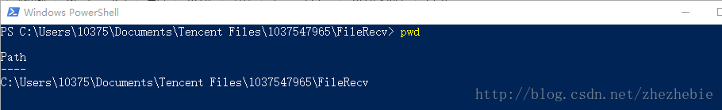
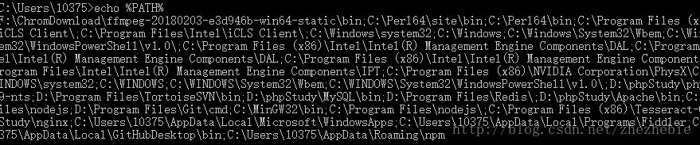
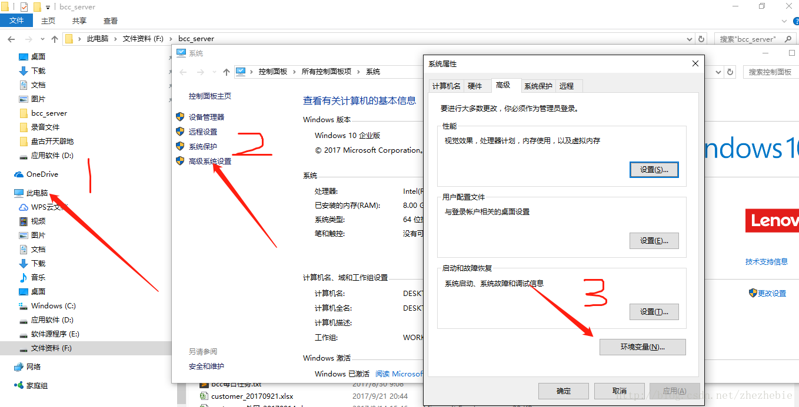
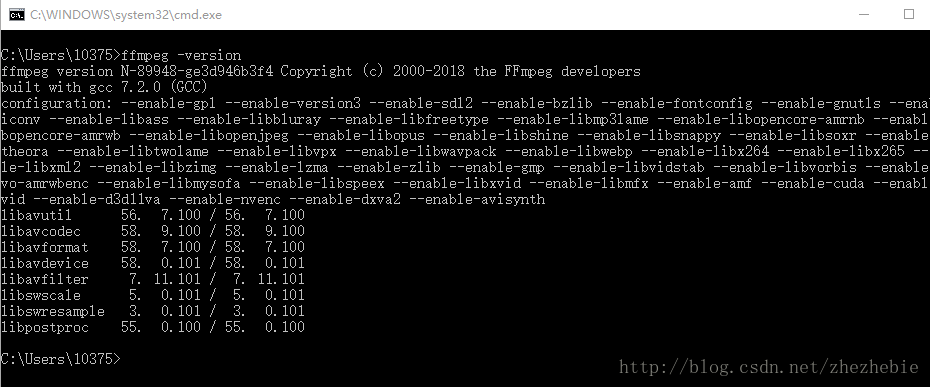

## 1、命令行方法，最快（推荐）；

### 1.1、获取应用安装绝对路径：

方法一：一层层点进去，然后复制路径栏目；
方法二：打开软件执行文件所在目录，按住shift点击鼠标邮件，选择powerShell，现在win10都自带了，输入：

```php
pwd
1
```

即可看到路径，划选点右键即可复制路径。


### 1.2、查看环境变量：

win+R输入cmd，打开命令行；

```php
C:\Users\10375>echo %PATH%
1
```

### 1.3、新添加一个环境变量，点右键即可将刚刚复制的路径粘贴到这里，后面的‘；’这个一定不要掉了，这个表示断点，这里表示将这个路径加到环境变量的最前面。

```php
setx /m PATH "%PATH%;D:\phpStudy\nginx"
#带/m表示全局,不带/m表示当前用户
12
```


这个会在新开的cmd窗口起作用,当前窗口还是识别不出来.
如果set后面不加x,那么只是当前session起作用,新开窗口不管用,注意区分!

### 1.4再次查看环境变量即可看到已经成功添加tesseract到全局环境变量了。

但是这种使用set命令的方式设置的环境变量只对当前命令行窗口有效。一旦关闭此窗口，再次运行另一个命令行窗口时，PATH环境变量还是原来的值。因此，我们必须在Windows下修改PATH环境变量。


## 2、传统方法：


参考文档：http://blog.csdn.net/zhezhebie/article/details/72765262

测试：成功！


> 注意1.
> 在某些情况下会出现“setx 无效语法 默认选项不能超过’2’次”的错误，据信是因为原先的环境变量中存在空格导致的，可使用双引号进行避免。
> 注意2.
> setx设置环境变量后，将在新打开的终端中生效，当前终端不会立即生效。
> 注意3.
> setx在设置变量的长度超过1024，会截取多出的字符。(可能和操作系统有关系,我的64位win10系统没有这个限制,windows命令说明也未有此说明,不知道是不是低版本的32位系统会有此限制)
> 注意4.
> setx还可以操作远程计算机，具体参数设置百度一下setx用法。
> 注意5.
> setx在设置某一变量的值，如果已经存在该变量会覆盖之前的值。所以正确方式是：要保存值=获取当前该变量的值+新值。

例如：set oldValue=获取当前变量值

```linux
setx path %oldValue%;%newValue%
1
```

以下为获取用户环境变量path的值，该例子读取注册表内的值。

```linux
@echo off  
set regPath= HKEY_CURRENT_USER\Environment  
set key=path  
::判断是否存在该路径  
reg query %regPath% /v  %key% 1>nul 2>nul  
if %ERRORLEVEL%==0 (  
::取值  
For /f "tokens=3,4 delims= " %%v in ('Reg Query %regPath% /v %key% ') do Set oldValue=%%v   
) else Set oldValue=""  
echo %key%的原值为：%oldValue%  
pause  
1234567891011
```

后面参考的:
https://blog.csdn.net/baiyibin0530/article/details/78841653

https://stackoverflow.com/questions/8358265/how-to-update-path-variable-permanently-from-cmd-windows

https://docs.microsoft.com/en-us/previous-versions/windows/it-pro/windows-server-2008-R2-and-2008/cc755104(v=ws.10)


---

---


## 个人信息：
### 姓名：邹建
### 19年加入 四川省装备制造机器人应用技术工程实验室，Dream Studio 软件工作室，负责软件开发相关工作
### 擅长：Unity游戏开发，Unity机器人仿真，C#编程语言，工业软件开发
### QQ：451991189
### B站ID：UnitySir
### 个人博客：
### [UnitySir - github.io](https://unitysir.github.io/)
### [UnitySir - 博客园 (cnblogs.com)](https://www.cnblogs.com/unitysir/)
### [- UnitySir (gitee.io)](https://unitysir.gitee.io/)
### [UnitySir (bilibili)](https://space.bilibili.com/308511666)
### B站ID：UnitySir

## 如果内容对你有所帮助：


---