## 行内与独行

### 行内公式

将公式插入到本行内

```latex
$公式内容$
\inline
```

例：坐标轴 

```latex
$xOy$
```

### 独行公式

公式单独占用一行

```latex
$$公式内容$$
\displaystyle
```

例：等差数列求和公式：

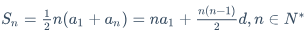

```latex
$$S_n = \frac{1}{2}n(a_1 + a_n) = na_1 + \frac{n(n-1)}{2}d, n\in N^*$$
```

------

## 上标、下标与组合

### 上标

```latex
$底数^指数$
$y = x^2$
```

例：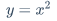

```latex
$y=x^2$
```

### 下标

```latex
$CuSO_4·5H_2O$
```

例：

```latex
$CuSO_4·5H_2O$
```

### 上下标组合

例：等比数列求和公式：

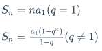

```latex
$$S_n = na_1 (q=1)$$
$$S_n = \frac{a_1 (1 - q^n)}{1-q} (q\neq1)$$
```

------

## 汉字、字体与格式

### 汉字形式

```latex
\mbox{}
```

例：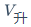

```latex
$V_{\mbox{升}}$
```

### 字体控制

不加此内容，公式会缩至与文字同高。加此内容，公式会以原大小显示。

```latex
\displaystyle
```

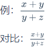

```latex
$\displaystyle \frac{x+y}{y+z}$
$\frac{x+y}{y+z}$
```

### 下划线符号

```latex
\underline
```

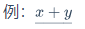

```latex
$\underline{x+y}$
```

### 标签

```latex
\tag{数字}
```

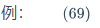

```latex
$\tag{69}$
```

### 上大括号

```latex
\overbrace{算式}
```

例：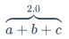

```latex
$\overbrace{a+b+c}^{2.0}$
```

### 下大括号

```latex
\underbrace{算式}
```

例：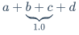

```latex
$a+\underbrace{b+c}_{1.0}+d$
```

### 上位符号

```latex
\stacrel{上位符号}{基位符号}
```

例：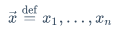

```latex
$\vec{x}\stackrel{\mathrm{def}}{=}{x_1,\dots,x_n}$
```

------

## 占位符

### 两个 quad 空格

```latex
\qquad
```

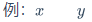

```latex
$x\qquad y$
```

### quad 空格

```latex
\quad
```

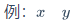

```latex
$x\quad y$
```

### 大空格

```latex
\
```

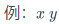

```latex
$x \ y$
```

### 中空格

```latex
\:
```

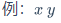

```latex
$x \: y$
```

### 小空格

```latex
\,
```

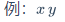

```latex
$x \, y$
```

### 贴紧

```latex
\!
```

例：

```latex
$x \! y$
```

### 无空格

例：

```latex
$xy$
```

------

## 界定符与组合

### 括号

```latex
\big(算式\big)
```

例：

```latex
$() \big(\big)$
```

### 中括号

```latex
[]
\left[ \right]
```

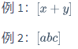

```latex
$[x + y]$
$\left[ abc \right]$
```

> 第二种中括号可以跨行，例如矩阵左右两边的中括号

### 大括号

```latex
\{算式\}
```

例：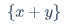

```latex
$\{x + y\}$
```

### 自适应括号

```latex
\left(算式 \right)
```

例：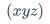

```latex
$\left(xyz\right)$
```

### 组合公式

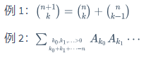

```latex
${n+1 \choose k}={n \choose k}+{n \choose k-1}$
$\sum_{k_0,k_1,\ldots>0 \atop k_0+k_1+\cdots=n}A_{k_0}A_{k_1}\cdots$
```

------

## 四则运算

### 加

例：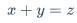

```latex
$x+y=z$
```

### 减

例：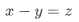

```latex
$x-y=z$
```

### 加减运算

```latex
\pm
```

例：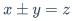

```latex
$x \pm y = z$
```

### 减加运算

```latex
\mp
```

例：

```latex
$x \mp y = z$
```

### 乘

#### 叉乘

```latex
\times
```

例：

```latex
$x \times y = z$
```

#### 点乘

```latex
\cdot
```

例：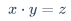

```latex
$x \cdot y = z$
```

#### 星乘

```latex
\ast
```

例：

```latex
$x \ast y = z$
```

### 除

#### 除号

```latex
\div
```

例：

```latex
$x \div y = z$
```

#### 斜杠除

```latex
x/y
```

例：

```latex
$x / y = z$
```

### 分式

```latex
\frac{分子}{分母}
{分子}\over{分母}
```

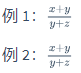

```latex
$\frac{x+y}{y+z}$
${x+y}\over{y+z}$
```

### 绝对值

```latex
|算式|
```

例：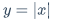

```latex
$y = |x|$
```

------

## 高级运算

### 平均数

```latex
\overline{算式}
```

例：

```latex
$\overline{xyz}$
```

### 开方

#### 开平方

```latex
\sqrt
```

例：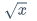

```latex
$\sqrt x$
```

#### 开多次方

```latex
\sqrt[开方数]{被开方数}
```

例：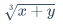

```latex
$\sqrt[3]{x+y}$
```

### 对数

```latex
\log
```

例：

```latex
$\log_5{x}$
```

### 极限

```latex
\lim
\displaystyle \lim
```

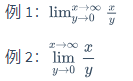

```latex
$\lim^{x \to \infty}_{y \to 0}{\frac{x}{y}}$
$\displaystyle \lim^{x \to \infty}_{y \to 0}{\frac{x}{y}}$
```

### 求和

```latex
\sum
\displaystyle \sum
```

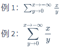

```latex
$\sum^{x \to -\infty}_{y \to 0}{\frac{x}{y}}$
$\displaystyle \sum^{x \to -\infty}_{y \to 0}{\frac{x}{y}}$
```

### 积分

```latex
\int
\displaystyle \int
```

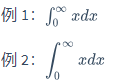

```latex
$\int^{\infty}_{0}{xdx}$
$\displaystyle \int^{\infty}_{0}{xdx}$
```

### 微分

```latex
\partial
\displaystyle \partial
```

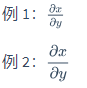

```latex
$\frac{\partial x}{\partial y}$
$\displaystyle \frac{\partial x}{\partial y}$
```

### 矩阵

```latex
\begin{matrix} \end{matrix}
```

例：

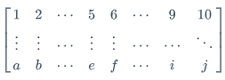

```latex
$$\left[ \begin{matrix} 1 & 2  & \cdots & 5 & 6 & \cdots & 9 & 10 \\ \vdots & \vdots & \cdots & \vdots & \vdots & \cdots & \cdots & \ddots \\ a & b & \cdots & e & f & \cdots & i & j \end{matrix} \right]$$
```

## 逻辑运算

### 大于、小于和等于

#### 大于

例：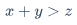

```latex
$x+y>z$
```

#### 大于等于

```latex
\geq
```

例：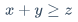

```latex
$x+y \geq z$
```

#### 小于

例：

```latex
$x+y<z$
```

#### 小于等于

```latex
\leq
```

例：

```latex
$x+y \leq z$
```

#### 等于

例：

```latex
$x+y=z$
```

### 不等于

```latex
\neq
```

例：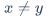

```latex
$x \neq y$
```

### 不大于等于、不小于等于

#### 不大于等于

```latex
\ngeq
\not\geq
```

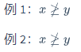

```latex
$x \ngeq y$
$x \not\geq y$
```

#### 不小于等于

```latex
\nleq
\not\leq
```

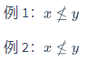

```latex
$x \nleq y$
$x \not\leq y$
```

### 约等于

```latex
\approx
```

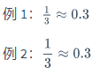

```latex
$\frac{1}{3} \approx 0.3$
$\displaystyle \frac{1}{3} \approx 0.3$
```

### 恒等于

```latex
\equiv
```

例：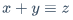

```latex
$x + y \equiv z$
```

------

## 集合运算

### 属于、不属于

#### 属于

```latex
\in
```

例：

```latex
$x \in A$
```

#### 不属于

```latex
\notin
\not\in
```

例：

```latex
$x \notin A, y \not \in B$
```

### 子集运算

#### 子集

```latex
\subset
\supset
```

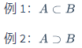

```latex
$A \subset B$
$A \supset B$
```

#### 非子集

```latex
\not\subset
\not\supset
```

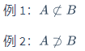

```latex
$A \not\subset B$
$A \not\supset B$
```

#### 真子集

```latex
\subseteq
\supseteq
```

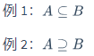

```latex
$A \subseteq B$
$A \supseteq B$
```

#### 非真子集

```latex
\subsetneq
\supsetneq
```

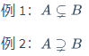

```latex
$A \subsetneq B$
$A \supsetneq B$
```

### 集合布尔运算

#### 交集

```latex
\cap
```


```latex
$A \cap B$
```

#### 并集

```latex
\cup
```


```latex
$A \cup B$
```

#### 差集

```latex
\setminus
```


```latex
$A \setminus B$
```

#### 同或运算

```latex
\bigodot
```


```latex
$A \bigodot B$
```

#### 同与运算

```latex
\bigotimes
```


```latex
$A \bigotimes B$
```

### 常用数集

```latex
\mathbb{数集字母}
```

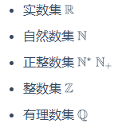

### 空集

```latex
\empty
\emptyset
```


------

## 标准函数

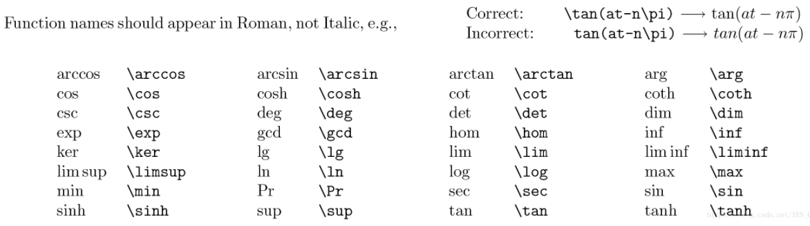

---

## 数学符号

### 无穷

```latex
\infty
```

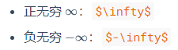

### 虚数

```latex
\imath
\jmath
```

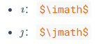

### 向量符号

```latex
\vec{字母}
```


```latex
$\vec{AC} = \vec{AB} + \vec{BC}$
```

### 导数

#### 一阶导数

```latex
\dot{a}
```


#### 二阶导数

```latex
\ddot{a}
```


以此类推：


### 箭头

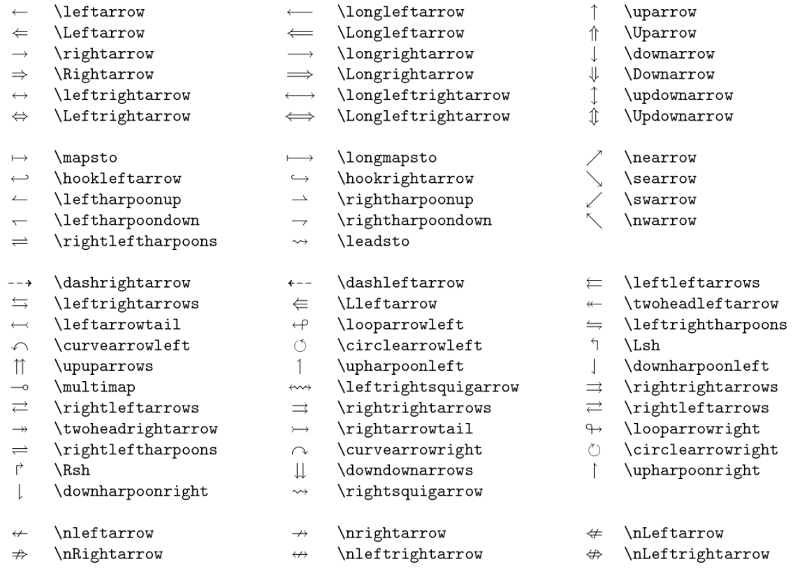

#### 上箭头


```latex
\uparrow
```

#### 双线上箭头


```latex
\Uparrow
```

#### 下箭头


```latex
\downarrow
```

#### 双线下箭头


```latex
\Downarrow
```

#### 左箭头


```latex
\leftarrow
```

#### 双线左箭头


```latex
\Leftarrow
```

#### 右箭头


```latex
\rightarrow
```

#### 双线右箭头


```latex
\Rightarrow
```

### 省略号

#### 低端对齐


```latex
\ldots
```

#### 中线对齐


```latex
\cdots
```

#### 垂直对齐


```latex
\vdots
```

#### 斜对齐


```latex
\ddots
```

### 其他数学符号

#### ā

```latex
$\bar{a}$
```

#### á

```latex
$\acute{a}$
```

#### ǎ

```latex
$\check{a}$
```

#### à

```latex
$\grave{a}$
```

#### â

```latex
$\hat{a}$
```

#### $\breve{a}$

```latex
$\breve{a}$
```

#### ã

```latex
$\tilde{a}$
```

#### å

```latex
$\mathring{x}$
```


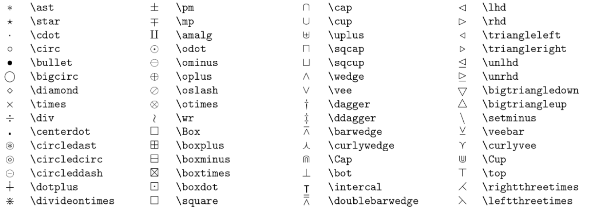

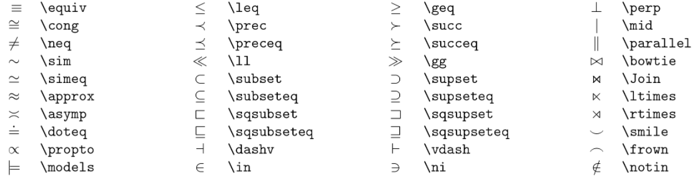


---


## 其他标志


---

## 数学模型


---


## 数组矩阵


---

## 希腊字母

| 大写字母 |    效果    |    实现    | 小写字母 |    效果    |    实现    |
| :------: | :--------: | :--------: | :------: | :--------: | :--------: |
|    A     |  $\Alpha$  |  `\Alpha`  |    α     |  $\alpha$  |  `\alpha`  |
|    B     |  $\Beta$   |  `\Beta`   |    β     |  $\beta$   |  `\beta`   |
|    Γ     |  $\Gamma$  |  `\Gamma`  |    γ     |  $\gamma$  |  `\gamma`  |
|    Δ     |  $\Delta$  |  `\Delta`  |    δ     |  $\delta$  |  `\delta`  |
|    Ε     | $\Epsilon$ | `\Epsilon` |    ε     | $\epsilon$ | `\epsilon` |
|    Ζ     |  $\Zeta$   |  `\Zeta`   |    ζ     |  $\zeta$   |  `\zeta`   |
|    Η     |   $\Eta$   |   `\Eta`   |    η     |   $\eta$   |   `\eta`   |
|    Θ     |  $\Theta$  |  `\Theta`  |    θ     |  $\theta$  |  `\theta`  |
|    Ι     |  $\Iota$   |  `\Iota`   |    ι     |  $\iota$   |  `\iota`   |
|    Κ     |  $\Kappa$  |  `\Kappa`  |    κ     |  $\kappa$  |  `\kappa`  |
|    Λ     | $\Lambda$  | `\Lambda`  |    λ     | $\lambda$  | `\lambda`  |
|    Μ     |   $\Mu$    |   `\Mu`    |    μ     |   $\mu$    |   `\mu`    |
|    Ν     |   $\Nu$    |   `\Nu`    |    ν     |   $\nu$    |   `\nu`    |
|    Ξ     |   $\Xi$    |   `\Xi`    |    ξ     |   $\xi$    |   `\xi`    |
|    Ο     | $\Omicron$ | `\Omicron` |    ο     | $\omicron$ | `\omicron` |
|    Π     |   $\Pi $   |   `\Pi`    |    π     |   $\pi$    |   `\pi`    |
|    Ρ     |   $\Rho$   |   `\Rho`   |    ρ     |   $\rho$   |   `\rho`   |
|    Σ     |  $\Sigma$  |  `\Sigma`  |    σ     |  $\sigma$  |  `\sigma`  |
|    Τ     |   $\Tau$   |   `\Tau`   |    τ     |   $\tau$   |   `\tau`   |
|    Υ     | $\Upsilon$ | `\Upsilon` |    υ     | $\upsilon$ | `\upsilon` |
|    Φ     |   $\Phi$   |   `\Phi`   |    φ     |   $\phi$   |   `\phi`   |
|    Χ     |   $\Chi$   |   `\Chi`   |    χ     |   $\chi$   |   `\chi`   |
|    Ψ     |   $\Psi$   |   `\Psi`   |    ψ     |   $\psi$   |   `\psi`   |
|    Ω     |  $\Omega$  |  `\Omega`  |    ω     |  $\omega$  |  `\omega`  |


---


## Latex 数学表达式


---


## 分隔符


---

## 变量符号


---


## 字体大小


---


## 文本模型


## 其他样式


---

---


## 个人信息：
### 姓名：邹建
### 19年加入 四川省装备制造机器人应用技术工程实验室，Dream Studio 软件工作室，负责软件开发相关工作
### 擅长：Unity游戏开发，Unity机器人仿真，C#编程语言，工业软件开发
### QQ：451991189
### B站ID：UnitySir
### 个人博客：
### [UnitySir - github.io](https://unitysir.github.io/)
### [UnitySir - 博客园 (cnblogs.com)](https://www.cnblogs.com/unitysir/)
### [- UnitySir (gitee.io)](https://unitysir.gitee.io/)
### [UnitySir (bilibili)](https://space.bilibili.com/308511666)
### B站ID：UnitySir

## 如果内容对你有所帮助：


---