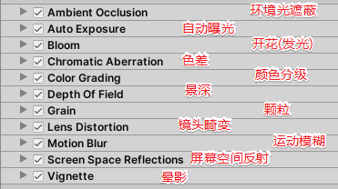

## 需要实现功能

实现一个不一样的视角效果

## 知识点

`https://github.com/Unity-Technologies/PostProcessing.git` 在Unity中添加资源包

**PostProcessing** 插件的使用

> `Post-process Debug` 的使用 :
>
> > 
>
> `Post-process Layer` 的使用 :
>
> > 1. 关闭 `Project Setting` 中 `Quality` 中的 `Anti Aliasing` （设置为 `Disable`即可）
> > 2. 将 MainCamera 中的 `Camera`组件 的 `Rendering Path`设置为`Deferred`，将`MSAA`设置为 `Off`
>
> `Post-process Volume` 的使用 :
>
> > 1. 在摄像机的同级创建一个空物体，命名为 `Postprocessing` ，勾选 `IsGlobal` 
> > 2. 创建一个 Post Process Profile 文件，并添加所有的效果
> > 3. 设置 Profile 

> 新建一个 Layer 名为 `Postcessing`
>
> 1. 将 `Post-process Layer`  中的 Layer 设置为 `Postcessing`
> 2. 将 `Postprocessing`对象的Layer 设置为 `Postcessing`

## 完整代码

## 参考链接

## 如果内容对你有所帮助：

### [UnitySir (bilibili)](https://space.bilibili.com/308511666)
### B站ID：UnitySir