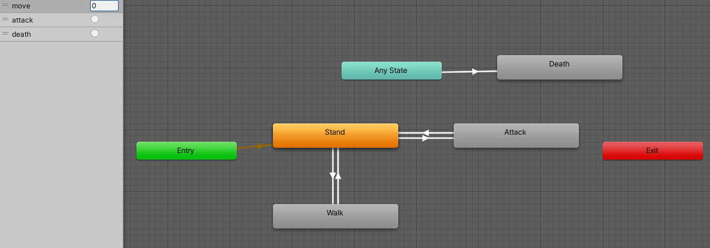

## 需要实现功能

在场景中加入一个怪物

---

## 知识点

在Unity商店中找到并导入`Fantasy Monster - Skeleton` 即可 [怪物资源链接](https://assetstore.unity.com/packages/3d/characters/humanoids/fantasy-monster-skeleton-35635)

将导入好的怪物的`Scale`改为`13`即可

---

将`Animator`设置为如下

## 完整代码

---

## 参考链接

 [怪物资源链接](https://assetstore.unity.com/packages/3d/characters/humanoids/fantasy-monster-skeleton-35635)

 

---

## 如果内容对你有所帮助：

### [UnitySir (bilibili)](https://space.bilibili.com/308511666)
### B站ID：UnitySir