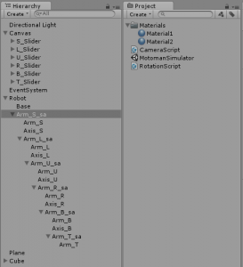
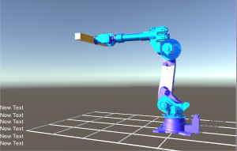

**视频：**

<iframe width="771" height="578" src="https://www.youtube.com/embed/9DqRkLQ5Sv8" frameborder="0" allow="accelerometer; autoplay; clipboard-write; encrypted-media; gyroscope; picture-in-picture"  ></iframe>

**项目地址：**

[unitysir/6DOF-robot-arm-IK: I built the Unity3d project with meuse.co.jp code. (github.com)](https://github.com/unitysir/6DOF-robot-arm-IK)


# 单臂机器人逆运动学解析方法


#### 逆运动学解析正文：


解释机器人手臂逆运动学的解析方法。 此方法仅适用于具有球形手腕（关节P4，P5，P6的轴在一个点处交汇）的机器人。 并且机器人不应有关节偏移。(Explaining analytical approach to inverse kinematics for robot arm. This method is applyed only for robots that have a spherical wrist (axis of joints P4,P5,P6 meets at one point). And robot should not have joint offsets.)

参考：Hirose的教科书“ Robotics”

---

向量(a，b) 表示末端执行器的方向和旋转。(Vector (a,b) represents the direction and rotation of end effector.)
$$
(a,b) = R^Y R^P R^R \left[
\matrix{
  1 & 0\\
  0 & 0\\
  0 & 1\\
}
\right]

\\

\left[
\matrix{
a_x & b_x\\
a_y & b_y\\
a_z & b_z\\
}
\right] = R^Y R^P R^R \left[
\matrix{
  C_Y C_P & C_Y S_P C_R + S_Y S_R\\
  S_Y C_P & S_Y S_P C_R - C_Y S_R\\
  -S_P & C_P C_R\\
}
\right]
$$


偏航角，俯仰角，滚动角由单位滑块指定。(Yaw,Pitch,Roll angles are given by unity sliders.)

```c#
px = S_Slider.value; //position
py = L_Slider.value;
pz = U_Slider.value;
rx = R_Slider.value; //rotation
ry = B_Slider.value;
rz = T_Slider.value;

ax = Mathf.Cos(rz * 3.14f / 180.0f) * Mathf.Cos(ry * 3.14f / 180.0f);
ay = Mathf.Sin(rz * 3.14f / 180.0f) * Mathf.Cos(ry * 3.14f / 180.0f);
az = -Mathf.Sin(ry * 3.14f / 180.0f);

bx = Mathf.Cos(rx * 3.14f / 180.0f) * Mathf.Sin(ry * 3.14f / 180.0f) * Mathf.Cos(rz * 3.14f / 180.0f)
            - Mathf.Sin(rx * 3.14f / 180.0f) * Mathf.Sin(rz * 3.14f / 180.0f);
by = Mathf.Cos(rx * 3.14f / 180.0f) * Mathf.Sin(ry * 3.14f / 180.0f) * Mathf.Sin(rz * 3.14f / 180.0f)
            - Mathf.Sin(rx * 3.14f / 180.0f) * Mathf.Cos(rz * 3.14f / 180.0f);
bz = Mathf.Cos(rx * 3.14f / 180.0f) * Mathf.Cos(ry * 3.14f / 180.0f);
```


点P<sub>5</sub>在向量上与P<sub>r</sub>的直线上。 (Point P<sub>5</sub> is on the vector a line from P<sub>r</sub>)
$$
P_5 = P_r - (l_5 + l_6)a
$$
或者  (or)
$$
P_{5X} = P_x - (l_5 + l_6)a_x
P_{5Y} = P_y - (l_5 + l_6)a_y
P_{5Z} = P_z - (l_5 + l_6)a_z
$$

```c#
p5x = px - (L5 + L6) * ax;
p5y = py - (L5 + L6) * ay;
p5z = pz - (L5 + L6) * az;
```


从手臂机器人的结构来看，(From the structure of arm robot,)
$$
\theta_1 = \arctan2(P_{5y},P_{5x}) \quad   or \quad  \theta_1 = \arctan2(P_{5y},P_{5x})+\pi
$$

```c#
theta[0] = Mathf.Atan2(p5y, p5x);
```

形成手臂机器人的运动学  (Form the Kinematics of arm robot,)
$$
\begin{align*} 
P_{5} &= \begin{bmatrix} 0 \\ 0 \\ l_{0}+l_{1}\end{bmatrix}\\\\ 
 &+ \begin{bmatrix} C_{1} & -S_{1} & 0 \\ S_{1} & C_{1} & 0 \\ 0 & 0 & 1\end{bmatrix}\begin{bmatrix} C_{2} & 0 & S_{2} \\ 0 & 1 & 0 \\ -S_{2} & 0 & C_{2}\end{bmatrix}\begin{bmatrix} 0 \\ 0 \\ l_{2}\end{bmatrix}\\\\ 
 &+ \begin{bmatrix} C_{1} & -S_{1} & 0 \\ S_{1} & C_{1} & 0 \\ 0 & 0 & 1\end{bmatrix}\begin{bmatrix} C_{23} & 0 & S_{23} \\ 0 & 1 & 0 \\ -S_{23} & 0 & C_{23}\end{bmatrix}\begin{bmatrix} 0 \\ 0 \\ l_{3}\end{bmatrix}\\\\ 
 &+ \begin{bmatrix} C_{1} & -S_{1} & 0 \\ S_{1} & C_{1} & 0 \\ 0 & 0 & 1\end{bmatrix}\begin{bmatrix} C_{23} & 0 & S_{23} \\ 0 & 1 & 0 \\ -S_{23} & 0 & C_{23}\end{bmatrix}\begin{bmatrix} C_{4} & -S_{4} & 0 \\ S_{4} & C_{4} & 0 \\ 0 & 0 & 1\end{bmatrix}\begin{bmatrix} 0 \\ 0 \\ l_{4}\end{bmatrix}\\\\ 
 &= \begin{bmatrix} 0 \\ 0 \\ l_{0}+l_{1}\end{bmatrix} + \begin{bmatrix} C_{1}S_{2} \\ S_{1}S_{2} \\ C_{2}\end{bmatrix}l_{2} + \begin{bmatrix} C_{1}S_{23} \\ S_{1}S_{23} \\ C_{23}\end{bmatrix}(l_{3} + l_{4}) 
\end{align*}
$$

$$
\begin{align*} 
P_{5x} &= C_{1}(S_{2}l_{2} + S_{23}(l_{3} + l_{4})) \tag{1}\\ 
P_{5y} &= S_{1}(S_{2}l_{2} + S_{23}(l_{3} + l_{4})) \tag{2}\\ 
P_{5z} - (l_{0} + l_{1}) &= C_{2}l_{2} + C_{23}(l_{3} + l_{4})\tag{3}\\
\end{align*}
$$


平方和  (Sum of squares,)
$$
\begin{align*} 
&(P_{5x})^2 + (P_{5y})^2 + (P_{5z} - (l_{0} + l_{1}))^2 \\ 
&= (S_{2}l_{2} + S_{23}(l_{3} + l_{4}))^2 + (C_{2}l_{2} + C_{23}(l_{3} + l_{4}))^2\\ 
&= l_{2}^2 + (l_{3} + l_{4})^2 + 2l_{2}(l_{3} + l_{4})(S_{2}S_{23} + C_{2}C_{23})\\ 
&= l_{2}^2 + (l_{3} + l_{4})^2 + 2l_{2}(l_{3} + l_{4})C_{3} 
\end{align*}
$$


（以上使用余弦定理）((Above used Cosine theorem))
$$
\begin{align*} 
C_{3} = \frac{1}{2l_{2}(l_{3} + l_{4})}(P_{5x}^2 + P_{5y}^2 + (P_{5z} - (l_{0} + l_{1}))^2 - l_{2}^2 - (l_{3} + l_{4})^2) 
\end{align*}
$$


因为 (for)
$$
S^2 + C^2 = 1
$$

$$
\begin{align*} 
\theta_{3} = atan2(\pm\sqrt{1 - C_{3}^2}, C_{3}) 
\end{align*}
$$

```c#
C3 = (Mathf.Pow(p5x, 2) + Mathf.Pow(p5y, 2) + Mathf.Pow(p5z - L1, 2) - Mathf.Pow(L2, 2) - Mathf.Pow(L3+L4, 2)) / (2 * L2 * (L3+ L4));
theta[2] = Mathf.Atan2(Mathf.Pow(1 - Mathf.Pow(C3, 2), 0.5f), C3);
```

((①的平方+②的平方))和③的平方根，使用  (Squareroot of (squre of (1) + square of (2)) and (3),using)
$$
S_{23} = S_{2}C_{3} + C_{2}S_{3}, C_{23} = C_{2}C_{3} - S_{2}S_{3}
$$

$$
\begin{align*} 
\sqrt{P_{5x}^2 + P_{5y}^2} &= (l_{2} + (l_{3} + l_{4})C_{3})S_{2} + ((l_{3} + l_{4})S_{3})C_{2}\\\\ 
P_{z5} - (l_{0} + l_{1}) &= - ((l_{3} + l_{4})S_{3})S_{2} + (l_{2} + (l_{3} + l_{4})C_{3})C_{2} 
\end{align*}
$$

当我们定义时 (when we define)
$$
\begin{align*} 
\sqrt{P_{5x}^2 + P_{5y}^2} \equiv A, \quad (l_{2} + (l_{3} + l_{4})C_{3}) \equiv M \\\\ 
P_{z5} - (l_{0} + l_{1}) \equiv B, \quad ((l_{3} + l_{4})S_{3}) \equiv N 
\end{align*}
$$

$$
\begin{align*} 
\begin{bmatrix} A \\ B \end{bmatrix} = \begin{bmatrix} M & N \\ -N & M\end{bmatrix}\begin{bmatrix} S_{2} \\ C_{2}\end{bmatrix} 
\end{align*}
$$

得到 S<sub>2</sub> , C<sub>2</sub> (to get S<sub>2</sub> , C<sub>2</sub>)
$$
\begin{align*} 
\begin{bmatrix} S_{2} \\ C_{2} \end{bmatrix} = \frac{1}{M^2 + N^2}\begin{bmatrix} M & -N \\ N & M\end{bmatrix}\begin{bmatrix} A \\ B\end{bmatrix} 
\end{align*}
$$
因此 θ<sub>2</sub> 是  (so θ<sub>2</sub>  is)
$$
\begin{align*} 
\theta_{2} = atan2(MA - NB, NA + MB) 
\end{align*}
$$

```c#
float M = L2 + (L3+ L4) * C3;
float N = (L3+ L4) * Mathf.Sin((float)theta[2]);
float A = Mathf.Pow(p5x*p5x + p5y*p5y, 0.5f);
float B = p5z - L1;
theta[1] = Mathf.Atan2(M*A - N*B, N*A + M*B);
```

现在我们有  **θ1,θ2,θ3 (theta[0],theta[1],theta[2]) ** (Now we haveθ1,θ2,θ3 (theta[0],theta[1],theta[2]).)

末端执行器(a,b)的位姿与基座(a,b)的位姿的关系为 (Relation between pose of end effector (a,b)(a,b) and pose of base (^a,^b)(a^,b^) is)
$$
\begin{align*} 
(a,b) = R_{1}R_{2}R_{3}R_{4}R_{5}R_{6}(\hat{a},\hat{b}) 
\end{align*}
$$
应用反向旋转(apply reverse rotations)
$$
\begin{align*} 
R_{3}^{-1}R_{2}^{-1}R_{1}^{-1}(a,b) = R_{4}R_{5}R_{6}(\hat{a},\hat{b}) 
\end{align*}
$$
左边可以用已知的值来计算。(Left side can be calculated with know values.)
$$
\begin{align*} 
&.\begin{bmatrix} C_{23} & 0 & -S_{23} \\ 0 & 1 & 0 \\ S_{23} & 0 & C_{23} \end{bmatrix}\begin{bmatrix} C_{1} & S_{1} & 0 \\ -S_{1} & C_{1} & 0 \\ 0 & 0 & 1 \end{bmatrix}\begin{bmatrix} a_{x} & b_{x} \\ a_{y} & b_{y} \\ a_{z} & b_{z}\end{bmatrix} \\\\ 
&= \begin{bmatrix} C_{23}(C_{1}a_{x} + S_{1}a_{y}) - S_{23}a_{z} & C_{23}(C_{1}b_{x} + S_{1}b_{y}) - S_{23}b_{z} \\ -S_{1}a_{x} + C_{1}a_{y} & -S_{1}b_{x} + C_{1}b_{y} \\ S_{23}(C_{1}a_{x} + S_{1}a_{y}) + C_{23}a_{z} & S_{23}(C_{1}b_{x} + S_{1}b_{y}) + C_{23}b_{z}\end{bmatrix} \\\\ 
&\equiv \begin{bmatrix}a_{x}^{*} & b_{x}^{*} \\ a_{y}^{*} & b_{y}^{*} \\ a_{z}^{*} & b_{z}^{*}\end{bmatrix} 
\end{align*}
$$
右边是 (Right side is)
$$
\begin{align*} 
&.\begin{bmatrix} C_{4} & -S_{4} & 0 \\ S_{4} & c_{4} & 0 \\ 0 & 0 & 1 \end{bmatrix}\begin{bmatrix} C_{5} & 0 & S_{5} \\ 0 & 1 & 0 \\ -S_{5} & 0 & C_{5} \end{bmatrix}\begin{bmatrix} C_{6} & -S_{6} & 0 \\ S_{6} & C_{6} & 0 \\ 0 & 0 & 1 \end{bmatrix}\begin{bmatrix} 0 & 1 \\ 0 & 0 \\ 1 & 0\end{bmatrix} \\\\ 
&= \begin{bmatrix} C_{4}S_{5} & C_{4}C_{5}C_{6} - S_{4}S_{6} \\ S_{4}S_{5} & S_{4}C_{5}C_{6} + C_{4}S_{6} \\ C_{5} & -S_{5}C_{6}\end{bmatrix} 
\end{align*}
$$
因此  θ<sub>4</sub>,θ<sub>5</sub>,θ<sub>6</sub> 都是 (So θ<sub>4</sub>,θ<sub>5</sub>,θ<sub>6</sub> are)
$$
\begin{eqnarray}  \left\{    \begin{array}{l} 
\theta_{4} = atan2(a_{y}^{*}, \ a_{x}^{*}) \quad or \quad atan2(a_{y}^{*}, \ a_{x}^{*}) + \pi\\ 
\theta_{5} = atan2(C_{4}a_{x}^{*} + S_{4}a_{y}^{*}, \ a_{z}^{*})\\ 
\theta_{6} = atan2(C_{4}b_{y}^{*} + S_{4}b_{x}^{*}, \ -b_{z}^{*}/S_{5})\\    \end{array}  \right.\end{eqnarray}
$$

```c#
C1 = Mathf.Cos((float)theta[0]);
C23 = Mathf.Cos((float)theta[1] + (float)theta[2]);
S1 = Mathf.Sin((float)theta[0]);
S23 = Mathf.Sin((float)theta[1] + (float)theta[2]);
 
asx = C23 * (C1 * ax + S1 * ay) - S23 * az;
asy = -S1 * ax + C1 * ay;
asz = S23 * (C1 * ax + S1 * ay) + C23 * az;
bsx = C23 * (C1 * bx + S1 * by) - S23 * bz;
bsy = -S1 * bx + C1 * by;
bsz = S23 * (C1 * bx + S1 * by) + C23 * bz;
 
theta[3] = Mathf.Atan2(asy, asx);
theta[4] = Mathf.Atan2(Mathf.Cos((float)theta[3]) * asx + Mathf.Sin((float)theta[3]) * asy, asz);
theta[5] = Mathf.Atan2(Mathf.Cos((float)theta[3]) * bsy - Mathf.Sin((float)theta[3]) * bsx,
            -bsz / Mathf.Sin((float)theta[4]));
```


**END**

---


---


---


---

[UnityでアームロボットIK | unity | Meuse Robotics](https://meuse.co.jp/unity/unityでアームロボットik/)


#### **网站原文1：**

[のアムロボットシミュレショに]運動（反向运动学を導してみました]スライダーでアーム先端の位置と姿勢(6軸)を指定するとロボットがこれを満足するように動きます。

我知道の計は広瀬[ロボット]をにしました]あまり広範囲には動かせないようにしていますのでとりあえずうまくいっているようです。

##### **翻译：**

<p>[对Amrobot模拟]运动（我试图指导反向运动）如果您用滑块指定了臂尖的位置和姿势（6个轴），则机器人将满足此要求。

我完全选择了Hirose [Robot]。]暂时看来它运行良好，因为我尝试不将其移至很大范围。


##### **源代码1**

```c#
public class CalcIK : MonoBehaviour {
 
    public Slider S_Slider;    //PositionX min=4 max=12
    public Slider L_Slider;    //PositionY min=-4 max=4
    public Slider U_Slider;    //PositionZ min=4 max=12
    public Slider R_Slider;    //RotationX min=-90 max=90
    public Slider B_Slider;    //RotationY min=-90 max=90
    public Slider T_Slider;    //RotationZ min=-90 max=90
    public static double[] theta = new double[6];    //angle of the joints
 
    private float L1, L2, L3, L4, L5, L6;    //arm length in order from base
    private float C3;
 
    void Start () {
        theta[0] = theta[1] = theta[2] = theta[3] = theta[4] = theta[5] = 0.0;
        L1 = 4.0f;
        L2 = 6.0f;
        L3 = 3.0f;
        L4 = 4.0f;
        L5 = 2.0f;
        L6 = 1.0f;
        C3 = 0.0f;
    }
     
    void Update () {
        float px, py, pz;
        float rx, ry, rz;
        float ax, ay, az, bx, by, bz;
        float asx, asy, asz, bsx, bsy, bsz;
        float p5x, p5y, p5z;
        float C1, C23, S1, S23;

        px = S_Slider.value;
        py = L_Slider.value;
        pz = U_Slider.value;
        rx = R_Slider.value;
        ry = B_Slider.value;
        rz = T_Slider.value;
 
        ax = Mathf.Cos(rz * 3.14f / 180.0f) * Mathf.Cos(ry * 3.14f / 180.0f);
        ay = Mathf.Sin(rz * 3.14f / 180.0f) * Mathf.Cos(ry * 3.14f / 180.0f);
        az = -Mathf.Sin(ry * 3.14f / 180.0f);

        p5x = px - (L5 + L6) * ax;
        p5y = py - (L5 + L6) * ay;
        p5z = pz - (L5 + L6) * az;
 
        theta[0] = Mathf.Atan2(p5y, p5x);
 
        C3 = (Mathf.Pow(p5x, 2) + Mathf.Pow(p5y, 2) + Mathf.Pow(p5z - L1, 2) - Mathf.Pow(L2, 2) - Mathf.Pow(L3+L4, 2))
            / (2 * L2 * (L3+ L4));
        theta[2] = Mathf.Atan2(Mathf.Pow(1 - Mathf.Pow(C3, 2), 0.5f), C3);
 
        float M = L2 + (L3+ L4) * C3;
        float N = (L3+ L4) * Mathf.Sin((float)theta[2]);
        float A = Mathf.Pow(p5x*p5x + p5y*p5y, 0.5f);
        float B = p5z - L1;
        theta[1] = Mathf.Atan2(M*A - N*B, N*A + M*B);
 
        C1 = Mathf.Cos((float)theta[0]);
        C23 = Mathf.Cos((float)theta[1] + (float)theta[2]);
        S1 = Mathf.Sin((float)theta[0]);
        S23 = Mathf.Sin((float)theta[1] + (float)theta[2]);
 
        bx = Mathf.Cos(rx * 3.14f / 180.0f) * Mathf.Sin(ry * 3.14f / 180.0f) * Mathf.Cos(rz * 3.14f / 180.0f)
            - Mathf.Sin(rx * 3.14f / 180.0f) * Mathf.Sin(rz * 3.14f / 180.0f);
        by = Mathf.Cos(rx * 3.14f / 180.0f) * Mathf.Sin(ry * 3.14f / 180.0f) * Mathf.Sin(rz * 3.14f / 180.0f)
            - Mathf.Sin(rx * 3.14f / 180.0f) * Mathf.Cos(rz * 3.14f / 180.0f);
        bz = Mathf.Cos(rx * 3.14f / 180.0f) * Mathf.Cos(ry * 3.14f / 180.0f);
 
        asx = C23 * (C1 * ax + S1 * ay) - S23 * az;
        asy = -S1 * ax + C1 * ay;
        asz = S23 * (C1 * ax + S1 * ay) + C23 * az;
        bsx = C23 * (C1 * bx + S1 * by) - S23 * bz;
        bsy = -S1 * bx + C1 * by;
        bsz = S23 * (C1 * bx + S1 * by) + C23 * bz;
 
        theta[3] = Mathf.Atan2(asy, asx);
        theta[4] = Mathf.Atan2(Mathf.Cos((float)theta[3]) * asx + Mathf.Sin((float)theta[3]) * asy, asz);
        theta[5] = Mathf.Atan2(Mathf.Cos((float)theta[3]) * bsy - Mathf.Sin((float)theta[3]) * bsx,
            -bsz / Mathf.Sin((float)theta[4]));
    }
}
```


---

[Unityでアームロボットをシミュレーション | unity | Meuse Robotics](https://meuse.co.jp/unity/unityでアームロボットをシミュレーション/)

#### 网站原文2：

安川電機のアームロボットを遠隔操作する案件があり、基本的にはWebカメラで見るのですが、ロボットの現在状況を3Dで表示したいということでUnityを使ってみました。
Unityに関しては、Courseraのゲーム開発のコースを途中まで視聴した程度のレベルです。ですのでシミュレーションといってもアニメーションを表示するだけのものです。

ここではわかりやすくするためにロボットの関節角度をUnityのUIスライダーで与えています。実際にはロボットの関節角度データはロボットのコントローラからもらいます.

台座から手先に向けて順番に入れ子構造にしていくことで、ある関節を回した時にそこから先のアームを一体で動かすことができます。各アームは根元から、S、L、U、R、B、Tと名前がついています。アームにはそれぞれ円柱部材（Axis）があって、それより手先側のアセンブリの回転軸となっています。

[](https://meuse.co.jp/wp/wp-content/uploads/2016/06/arm_robot_unity_2.png)

Cadのデータを使ってかっこよくしたものがこちらです。

[](https://meuse.co.jp/wp/wp-content/uploads/2016/06/arm_robot_unity_3.png)

描画フレームごとにスクリプト（RotationScript.cs）で各軸の回転処理を行います。


##### **翻译**

有一个可以远程控制Yasukawa Electric手臂机器人的项目，我基本上可以通过网络摄像头看到它，但是我想以3D方式显示机器人的当前状态，因此我尝试使用Unity。
至于Unity，则是大约观看Coursera的游戏开发课程的水平。因此，模拟只是显示动画。

在这里，为清楚起见，机器人的关节角度由Unity UI滑块给出。实际上，机器人的关节角度数据是从机器人的控制器获得的。

通过从基座到手按顺序创建嵌套结构，当转动某个关节时，可以整体移动超出该范围的手臂。从根开始，每个手臂都被命名为S，L，U，R，B，T。每个臂都有一个圆柱形的构件（轴），该构件是手侧组件的旋转轴。


这是一个使用Cad数据的不错的版本。


使用每个图纸框架的脚本（RotationScript.cs）旋转每个轴。

##### **源代码：**

```c#
public class RotationScript : MonoBehaviour
{
    public Transform target;
    public Vector3 direction;
    public int axisNum;
    private Vector3 targetPos;
    private float[] data = new float[6];
    private float[] angle = new float[6];
     
    public Slider S_Slider;
    public Slider L_Slider;
    public Slider U_Slider;
    public Slider R_Slider;
    public Slider B_Slider;
    public Slider T_Slider;
     
    void Start()
    {
        for (int i = 0; i < 6; i++)
        {
            angle[i] = 0;
        }
    }
 
    void Update()
    {
        data[0] = S_Slider.value;
        data[1] = L_Slider.value;
        data[2] = U_Slider.value;
        data[3] = R_Slider.value;
        data[4] = B_Slider.value;
        data[5] = T_Slider.value;
        if (angle[axisNum] != data[axisNum])
        {
            targetPos = target.position;
            transform.RotateAround(targetPos, target.up, data[axisNum]-angle[axisNum]);
            angle[axisNum] = data[axisNum];
        }
    }
}
```


---

---

---


#### 国外网站参考：

* [Meuse Robotics](https://meuse.co.jp/)

```
爱好机器人和电子玩具的规划和开发 • 嵌入式电路设计、软件开发
• 机电一体化设备开发和设计
• 制造商大规模生产设计支持
• 工业臂机器人控制软件开发
```

**机器人、逆运动学：**

* [Unity Arm Robot Inverse Kinematics -analytical approach | unity | Meuse Robotics](https://meuse.co.jp/unity/unity-arm-robot-inverse-kinematics-analytical-approach/)
  * [UnityでアームロボットIK | unity | Meuse Robotics](https://meuse.co.jp/unity/unityでアームロボットik/)

* [Unityでアームロボットをシミュレーション | unity | Meuse Robotics](https://meuse.co.jp/unity/unityでアームロボットをシミュレーション/)


---

---


## 个人信息：
### 姓名：邹建
### 19年加入 四川省装备制造机器人应用技术工程实验室，Dream Studio 软件工作室，负责软件开发相关工作
### 擅长：Unity游戏开发，Unity机器人仿真，C#编程语言，工业软件开发
### QQ：451991189
### B站ID：UnitySir
### 个人博客：
### [UnitySir - github.io](https://unitysir.github.io/)
### [UnitySir - 博客园 (cnblogs.com)](https://www.cnblogs.com/unitysir/)
### [- UnitySir (gitee.io)](https://unitysir.gitee.io/)
### [UnitySir (bilibili)](https://space.bilibili.com/308511666)
### B站ID：UnitySir

## 如果内容对你有所帮助：


---
